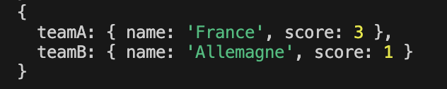

# Football Score Predictor


A Node.js typescript package to predict the score between two national football teams based on FIFA rankings and recent stats like wins/losses and goals scored/conceded.

## Table of Contents

- [Football Score Predictor](#football-score-predictor)
  - [Table of Contents](#table-of-contents)
  - [Installation](#installation)
  - [Usage](#usage)
  - [Example](#example)
    - [Screenshot](#screenshot)
  - [Output](#output)
  - [Roadmap](#roadmap)
  - [Contributing](#contributing)
  - [License](#license)
  - [Contact](#contact)

## Installation

```bash
npm install football-score-predictor
```

or using yarn

```bash
yarn add football-score-predictor
```

## Usage

```typescript
import { predictScore } from "football-score-predictor";
```

## Example

```typescript
predictScore({
  teamA: "France",
  teamB: "Allemagne",
}).then((scorePrediction) => console.log(scorePrediction));
```

### Screenshot



## Output

The prediction will return an object with the following format:

```json
{
  "teamA": { "name": "France", "score": 3 },
  "teamB": { "name": "Allemagne", "score": 1 }
}
```

## Roadmap

- Improve score calculations with as many stats as possible
- Use english names for teams
- Handle teams with spaces and special characters in their names
- Include clubs in the predictions

## Contributing

1. Fork the repository
2. Create your feature branch (\`git checkout -b feature/fooBar\`)
3. Commit your changes (\`git commit -am 'Add some fooBar'\`)
4. Push to the branch (\`git push origin feature/fooBar\`)
5. Create a new Pull Request

## License

This project is licensed under the MIT License.

## Contact

[Open an issue](https://github.com/LorenzoAversano/football-score-predictor/issues)
